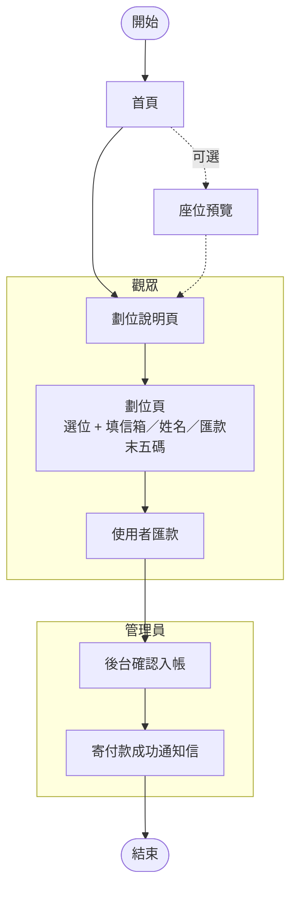

# 台大魔夜劃位系統

每年一次的線上劃位系統。2026 起翻新成全 Firebase（Firestore + Functions + Hosting），前後端 mono-repo。

線上版：

- 自訂網域：[https://ntumagic.club](https://ntumagic.club)
- Firebase 預設：[https://ntu-magic-night.web.app/](https://ntu-magic-night.web.app/)

舊版後端（MERN）已 archive：[ntumagic-server (archived)](https://github.com/xieyou0608/ntumagic-server)

## 劃位流程

觀眾不需要註冊帳號，只填**信箱、姓名、匯款末五碼**就能下訂；確認入帳跟寄通知信都是管理員手動操作。



## 結構

```
.
├── web/                    # 前端（CRA + React 17 + MUI + Redux Toolkit）
│   ├── src/
│   ├── public/
│   └── package.json
├── functions/              # 後端 Firebase Functions (Node 20)
│   ├── index.js            # 入口 exports.api = onRequest(app)
│   ├── app.js              # Express app
│   ├── lib/                # firestore / email / phases / auth-middleware
│   ├── routes/             # /api/seats, /api/admin
│   └── package.json
├── scripts/                # 本機腳本（座位 seed）
├── docs/                   # 設計文件 + 流程圖
├── firebase.json           # 統一描述 functions + hosting + firestore + emulators
├── firestore.rules         # 預設全拒，所有 IO 走 Functions
└── firestore.indexes.json
```

## 一次性設定

```sh
# CLI
npm i -g firebase-tools
firebase login
gcloud auth application-default login
gcloud config set project ntu-magic-night

# 依賴
cd web && npm install
cd ../functions && npm install
cd ../scripts && npm install
```

接著：

1. **Firebase Console > Authentication** 啟用 Email/Password 並建一個 admin 帳號（密碼由負責人交接）
2. **設 secrets**：
   ```sh
   firebase functions:secrets:set GMAIL_PASSWORD
   ```
3. **設一般 env**：`cp functions/.env.example functions/.env`，填 `ADMIN_EMAIL` / `GMAIL_ACCOUNT`

## 本機開發

repo 根目錄統一用 npm script：

| 指令 | 用途 |
| --- | --- |
| `npm run emulators` | 啟 emulator（functions / firestore / auth / hosting），import/export `.emulator-data/` |
| `npm run emulators:clean` | 砍掉 `.emulator-data/` 重啟，狀態歸零 |
| `npm run emulators:seed` | 對 emulator 跑 `seed-seats.js --reset`（要先有 emulator 在跑） |
| `npm run web` | CRA dev server（port 3000，hot reload），`REACT_APP_API_URL` 自動指到 emulator hosting |

預設網址：

- 前端 dev server（hot reload）：http://localhost:3000
- 前端 + API（emulator hosting）：http://localhost:5005
- Emulator UI：http://localhost:4000

典型流程：T1 跑 `emulators:clean`，T2 跑 `emulators:seed`，T3 跑 `web`。之後想接續上次狀態就直接 `emulators`（會 import）。

## 部署

| 指令 | 用途 |
| --- | --- |
| `npm run deploy` | 前端 build + 全部部署（functions + hosting + firestore rules / indexes） |
| `npm run deploy:web` | 前端 build + 只部署 hosting |
| `npm run deploy:functions` | 只部署 functions |

第一次活動前 / 換劇場：改 `scripts/generate-seats.js`、用 ADC 對 prod 跑 `cd scripts && npm run seed:reset`，DB schema / API / 前端都不用動。

## 每年活動要改的設定

每年活動改變的東西（票價、phase 時間、活動日期、匯款資訊）都集中在兩支設定檔，前後端各一份：

- [functions/lib/event-config.js](functions/lib/event-config.js) — 後端：phase 時間、寄信文案、匯款帳戶、票價（含 S 區）
- [web/src/event-config.js](web/src/event-config.js) — 前端顯示用：活動日期、票價（A/B/C）、匯款帳戶、校內/校外時間 label

兩邊要同步改（後端的 phase 時間是 source of truth、前端只做 UX 提示）。CRA 不能直接 import 出 `web/src/` 之外的檔案，所以暫時維持兩份；確認對齊就好。

## API 摘要

| Method | Path                       | 用途                                  |
| ------ | -------------------------- | ------------------------------------- |
| GET    | `/api/seats`               | 全部座位（含 placeholder）            |
| POST   | `/api/seats/getSeat`       | 用 email 取自己劃的座位               |
| PATCH  | `/api/seats/booking`       | 搶位 transaction（受 PHASE 階段控管） |
| GET    | `/api/admin/bookings`      | 列出所有訂單（含座位）                |
| PATCH  | `/api/admin/clearAllSeats` | 全部歸零                              |
| PATCH  | `/api/admin/clearByEmail`  | 清掉某 email 的所有座位               |
| PATCH  | `/api/admin/removeSeat`    | 移除單一座位                          |
| PATCH  | `/api/admin/area`          | 改座位 area                           |
| PATCH  | `/api/admin/markPaid`      | 標記某 email 所有座位為已付款         |
| POST   | `/api/admin/sendPaidEmail` | 寄付款成功通知信                      |

`/api/admin/*` 需要 `Authorization: Bearer <Firebase ID Token>`，該帳號 email 必須等於 `ADMIN_EMAIL`。

詳細設計見 [docs/system-migration-plan.md](docs/system-migration-plan.md) 與 [docs/implementation-research.md](docs/implementation-research.md)。
