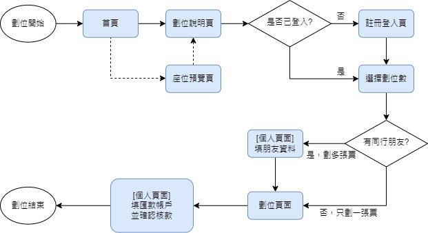

# 台大魔夜劃位系統

每年一次的線上劃位系統。2026 起翻新成全 Firebase（Firestore + Functions + Hosting），前後端 mono-repo。

線上版：[https://ntu-magic-night.web.app/](https://ntu-magic-night.web.app/)

舊版（MERN）已 archive：[ntumagic-server (archived)](https://github.com/xieyou0608/ntumagic-server)



## 結構

```
.
├── web/                    # 前端（CRA + React 17 + MUI + Redux Toolkit）
│   ├── src/
│   ├── public/
│   └── package.json
├── functions/              # 後端 Firebase Functions (Node 20)
│   ├── index.js            # 入口 exports.api = onRequest(app)
│   ├── app.js              # Express app
│   ├── lib/                # firestore / email / phases / tokens / auth-middleware
│   ├── routes/             # /api/seats, /api/audience, /api/admin
│   └── package.json
├── scripts/                # 本機腳本（座位 seed）
├── docs/                   # 設計文件 + 流程圖
├── firebase.json           # 統一描述 functions + hosting + firestore + emulators
├── firestore.rules         # 預設全拒，所有 IO 走 Functions
└── firestore.indexes.json
```

## 一次性設定

```sh
# CLI
npm i -g firebase-tools
firebase login
gcloud auth application-default login
gcloud config set project ntu-magic-night

# 依賴
cd web && npm install
cd ../functions && npm install
cd ../scripts && npm install
```

接著：

1. **Firebase Console > Authentication** 啟用 Email/Password 並建一個 admin 帳號（密碼由負責人交接）
2. **設 secrets**：
   ```sh
   firebase functions:secrets:set GMAIL_PASSWORD
   firebase functions:secrets:set EMAIL_HASH_SECRET
   ```
3. **設一般 env**：`cp functions/.env.example functions/.env`，填 `ADMIN_EMAIL` / `GMAIL_ACCOUNT` / `VERIFY_BASE_URL`

## 本機 emulator

```sh
firebase emulators:start --only functions,firestore,auth,hosting
```

預設網址：

- 前端：http://localhost:5005
- API（透過 hosting rewrite）：http://localhost:5005/api/...
- Emulator UI：http://localhost:4000

Seed 座位（連 emulator）：

```sh
FIRESTORE_EMULATOR_HOST=127.0.0.1:8080 GOOGLE_CLOUD_PROJECT=ntu-magic-night node scripts/seed-seats.js
```

## 部署

```sh
cd web && npm run build && cd ..
firebase deploy
```

第一次活動前 / 換劇場時：

```sh
node scripts/seed-seats.js          # 第一次
node scripts/seed-seats.js --reset  # 重灌
```

換劇場時改 `scripts/generate-seats.js` 重跑 `--reset` 即可，DB schema / API / 前端都不用動。

## API 摘要

| Method | Path                       | 用途                                  |
| ------ | -------------------------- | ------------------------------------- |
| GET    | `/api/seats`               | 全部座位（含 placeholder）            |
| POST   | `/api/seats/getSeat`       | 用 email 取自己劃的座位               |
| PATCH  | `/api/seats/booking`       | 搶位 transaction（受 PHASE 階段控管） |
| PATCH  | `/api/audience/verify`     | 點驗證信連結後設 `emailVerified`      |
| GET    | `/api/admin/bookings`      | 列出所有訂單（含座位）                |
| PATCH  | `/api/admin/clearAllSeats` | 全部歸零                              |
| PATCH  | `/api/admin/clearByEmail`  | 清掉某 email 的所有座位               |
| PATCH  | `/api/admin/removeSeat`    | 移除單一座位                          |
| PATCH  | `/api/admin/area`          | 改座位 area                           |
| PATCH  | `/api/admin/markPaid`      | 標記某 email 所有座位為已付款         |
| POST   | `/api/admin/sendPaidEmail` | 寄付款成功通知信                      |

`/api/admin/*` 需要 `Authorization: Bearer <Firebase ID Token>`，該帳號 email 必須等於 `ADMIN_EMAIL`。

詳細設計見 [docs/system-migration-plan.md](docs/system-migration-plan.md) 與 [docs/implementation-research.md](docs/implementation-research.md)。
